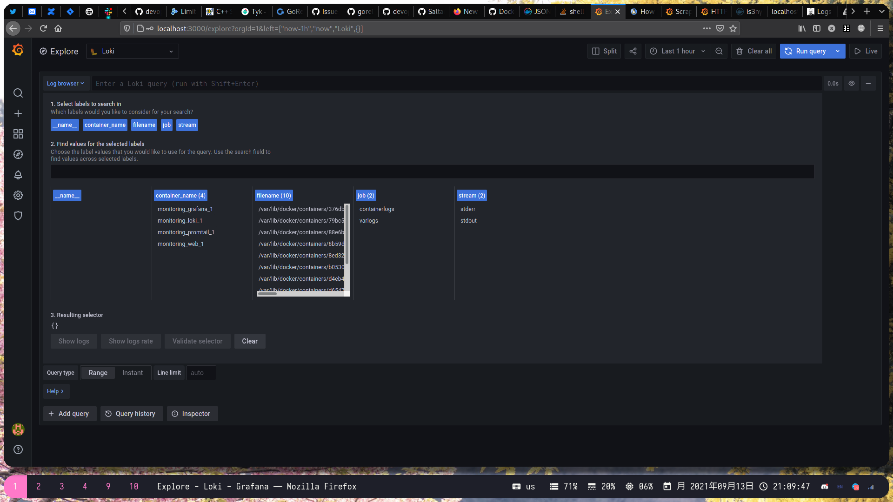
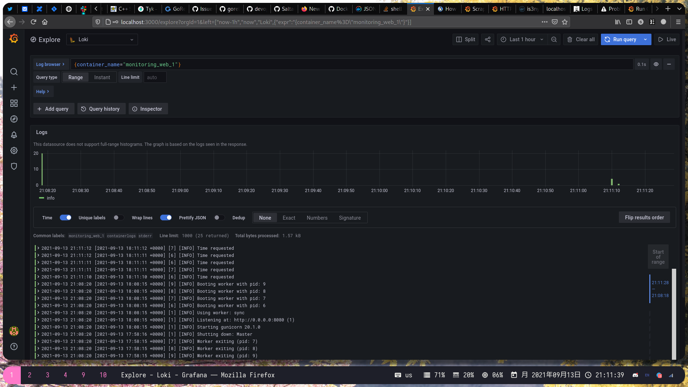
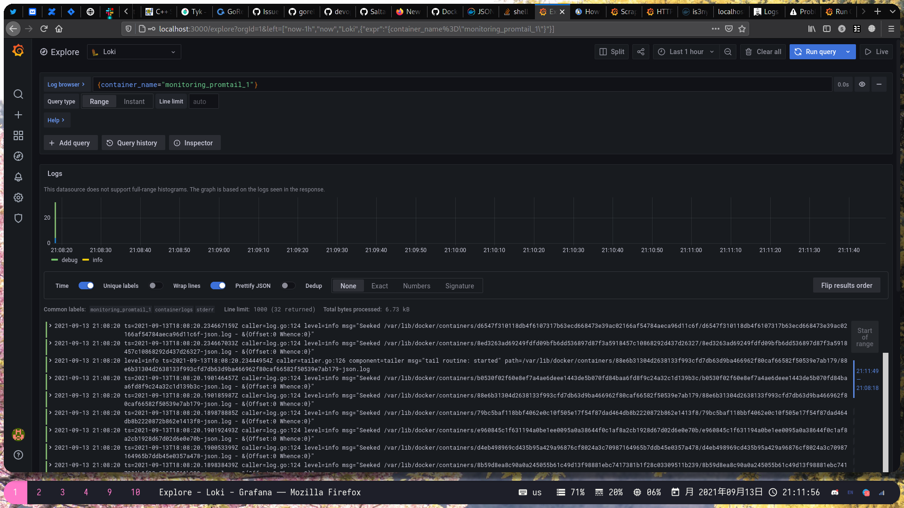

# Promtail.Loki.Grafana stack

## Setting it up

The `docker-compose.yaml` deploys PLG stack together with application. Promtail is configured to scrape logs from the containers and thus the `/var/lib/docker/containers` directory is mapped for promtail. The logs are being generated by docker and are enabled for every container by using the `logging` key in the `docker-compose.yml`.

The app was updated to produce logs on a GET request.

Available tags in grafana:


Logs from the application:


Logs from the promtail:


## Best practices

### Use static tags as much as possible

Using static tags allows for less overhead when logging. Commonly recommended static tags when injecting labels before the logs are sent to Loki include

- Physical machine: kubernetes/hosts
- Application name: kubernetes/labels/app_kubernetes_io/name
- Component names: kubernetes/labels/name
- Namespace: kubernetes/namespace
- Other static labels for kubernetes/label/\*, such as environment, version, and other information

## Use dynamic labels carefully

Too many label combinations can cause a lot of streams, which can make Loki store a lot of indexes and small chunks of object files. These can significantly drain Loki's query performance. To avoid these problems, don't add tags until you know you need them!

### Bounded tag value ranges

If you have to use dynamic tags, then you also have to be careful to control the range of tags and the length of value values. For example, if you want to extract some fields from the nginx access log and store them in loki

```
{"@timestamp": "2020-09-30T12:16:07+08:00","@source": "172.16.1.1", "hostname": "node1", "ip":"-", "client": "172.16.2.1", "request_method ": "GET", "scheme": "https", "domain": "xxx.com", "referer":"-", "request":"/api/v1/asset/asset?page_size=-1&group=23", "args": "page_size= -1&group=23", "size":975, "status": 200, "responsetime":0.065, "upstreamtime": "0.064", "upstreamaddr": "172.16.3.1:8080", "http_user_agent ": "python-requests/2.22.0", "https": "on"}
```

Here `@source` represents the client source address, and since the source address is a public address, its value is an unbounded one when creating the loki tag. For example, `@request` represents the request URL, and there may be some request parameters that are too long, and the loki tag value may be too large. If the two are multiplied together, then the size of the tag is unacceptable.

The above case is more of a typical unbounded dynamic tag value, in loki we use *cardinality* to express it, The higher the cardinality value, the less efficient loki's query. The range of dynamic labels, as recommened by the loki community, should be "controlled within 10" as much as possible.

### Configure cache

**cache_config** is Loki's cache configuration block. The main caches supported by Loki 1.6 are `in-memory`, `memcached` and `redis`. Each of these three cache types has its own scenario requirements, so if your Loki is an AllinOne deployment, you can choose one of the three. If your Loki is a distributed architecture, then you can choose redis as your primary cache service

Query result cache: **queryrange_config** defines the configuration of caching and chunking for Loki queries.

Log index cache: **index_queries_cache_config** defines Loki's index cache, which in most cases can be equated to the query cache of the log label.

Raw log cache: **chunk_store_config** defines Loki's configuration for writing raw logs to the store, the main purpose of introducing caching here is to increase the throughput of Loki logs receiving logs.

Restrictions: **limits_config** defines the global and per-tenant limits for extracting logging configuration in Loki.
